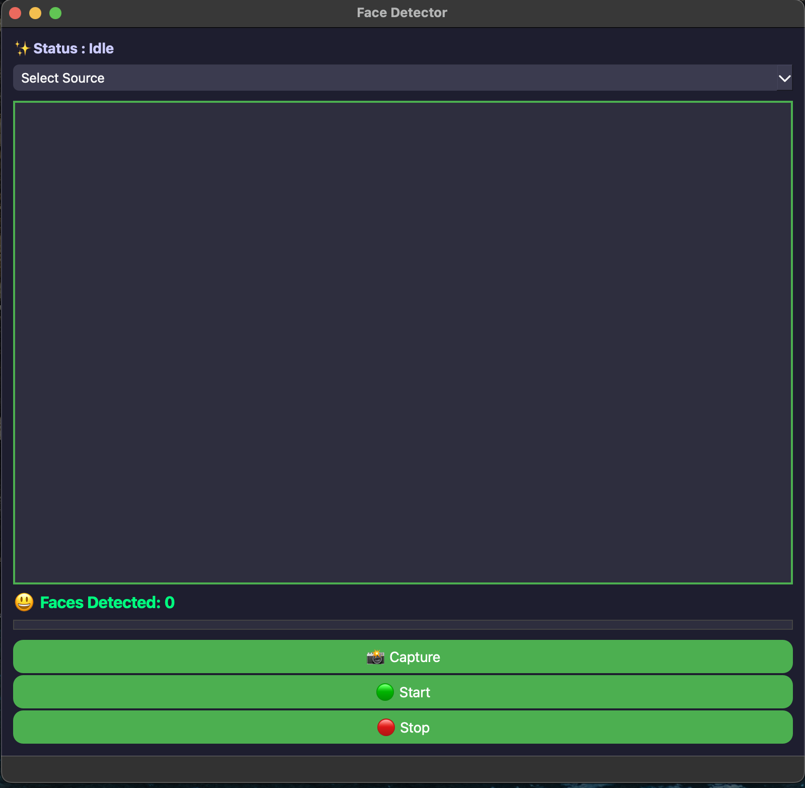
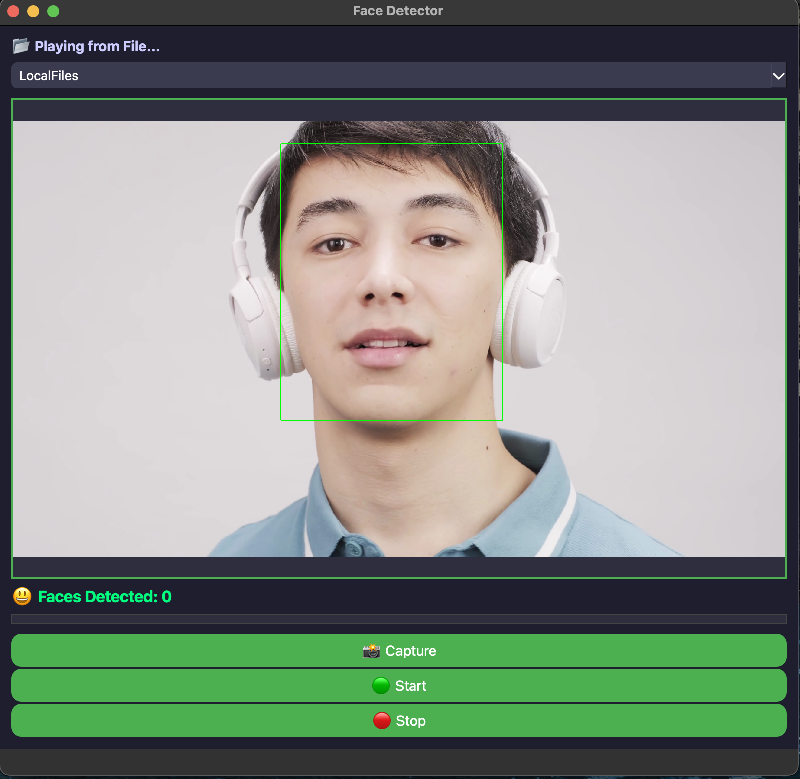
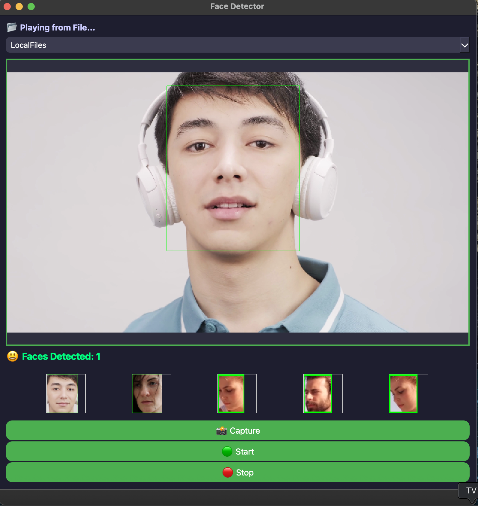

# 🧠 FaceDetector - Qt C++ Real-Time Face Detection App

A powerful real-time face detection desktop application built using **Qt (C++)**, **OpenCV DNN**, and **modern UI** principles. It supports **webcam**, **local video files**, **manual face capture**, and **thumbnail previews**, making it ideal for educational projects, research, or internship showcases.

---

## 🚀 Features

- 🎥 Live webcam streaming with real-time face detection
- 📁 Load and analyze local video files
- 🤖 DNN-based face detection using OpenCV’s `res10_300x300_ssd` model
- 🖼️ Thumbnail previews of manually captured faces
- 💾 Saves cropped face images to `faces/` folder with **timestamped filenames**
- 🎛️ Responsive modern GUI built with Qt Designer
- 🟢 Start / 🔴 Stop / 📸 Capture buttons
- ✨ Status label + face count label
- ✅ Fully working on macOS (Apple Silicon / Intel)

---

## 📸 Screenshots

| Live Detection | Face Capture | Thumbnails |
|----------------|--------------|------------|
|  |  |  |

---

## 🧰 Tech Stack

- **Language**: C++
- **GUI**: Qt 6 / Qt Widgets
- **Face Detection**: OpenCV 4.x + DNN module
- **Build System**: CMake
- **Platform**: macOS (tested on Qt 6.9.1)

---

## 📂 Folder Structure

FaceDetector/
├── main.cpp
├── mainwindow.cpp / .h / .ui
├── haarcascade_frontalface_default.xml (optional)
├── deploy.prototxt
├── res10_300x300_ssd_iter_140000.caffemodel
├── faces/ # Cropped face images saved here
├── CMakeLists.txt
└── README.md


---

## 💻 How to Run

### 1. Clone the Repository

```bash
git clone https://github.com/manavmax/FaceDetector.git
cd FaceDetector
```
### 2. Open in Qt Creator
File → Open Project → CMakeLists.txt
Make sure OpenCV is linked in Kit / CMake configuration

### 3. Build & Run
Click the green ▶️ Run button in Qt Creator

### Select Webcam or Browse File from the dropdown
---
## ⚙️ Model Files Required

    Ensure the following two files are placed in the same folder as the executable: 
    deploy.prototxt res10_300x300_ssd_iter_140000.caffemodel
    If running from Qt Creator, copy them to the build/ directory:</small>
    cp deploy.prototxt res10_300x300_ssd_iter_140000.caffemodel ./build/</small>
---
### 🙋‍♂️ Author
    Manav Sharma
---
### 🏁 Status
✅ Project is complete and fully functional.

🎯 Actively used as a sample for internship application and desktop vision projects.

